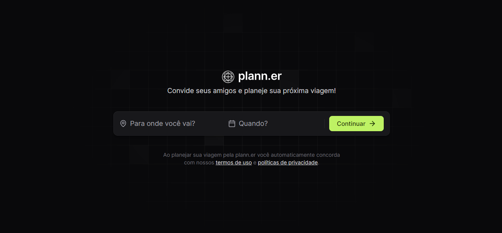
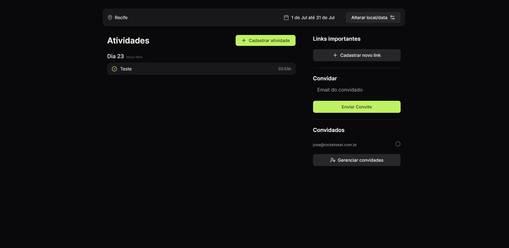
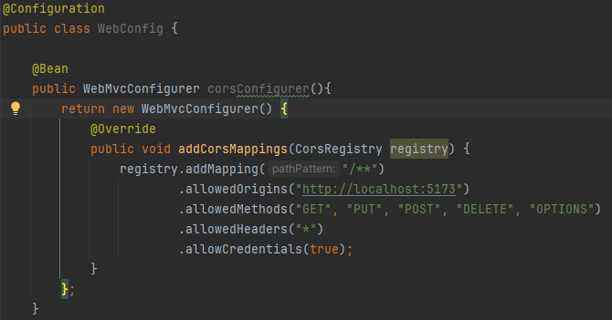
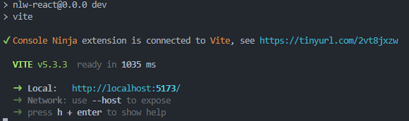

# Planner Full Stack




## Descrição

Este é um projeto da RocketSeat de um Planner full stack desenvolvido com React, TypeScript, Vite, TailwindCss no frontend e Java com Spring Boot e banco de dados H2 no backend.

## Funcionalidades

- Cadastro de atividades e links para a viagem.
- Convite e confirmação de usuários.
- Persistência de dados utilizando um banco de dados H2 embarcado.
- Interface de usuário intuitiva.

## Tecnologias Utilizadas

### Frontend

- [React](https://reactjs.org/)
- [TypeScript](https://www.typescriptlang.org)
- [Vite](https://vitejs.dev/)
- [TailwindCss](https://tailwindcss.com)

### Backend

- [Java](https://www.java.com/pt-BR/)
- [Spring Boot](https://spring.io/projects/spring-boot)
- Banco de Dados H2 (embarcado)

## Pré-requisitos

- [Node.js](https://nodejs.org/)
- [JDK (Java Development Kit)](https://www.oracle.com/br/java/technologies/downloads/)
- IDE de sua preferência (como IntelliJ IDEA, Eclipse, etc.)

## Instalação e Execução

Siga estas etapas para rodar o projeto na sua máquina local:

### Backend (Spring Boot)

1. **Clone o repositório:**

   ```bash
   git clone https://github.com/beater27032001/Planner-rocketseat.git
   cd Planner-rocketseat/planner

2. **Importe o projeto na sua IDE** e aguarde a importação das dependências do Maven.

3. **Execute o aplicativo Spring Boot.** Isso iniciará o servidor backend na porta padrão **8080**.

4. **Verifique se o backend está funcionando** acessando **http://localhost:8080** no seu navegador. Você deve ver uma página padrão do Spring indicando que o servidor está rodando.

5. **Verifique o caminho no front para se preciso trocar no back.**

   

### Frontend (React)

1.**Abra um novo terminal** na raiz do projeto (ou na pasta onde deseja colocar o frontend).

2. **Navegue até a pasta frontend:**

   ```bash
   cd nlw-react

3. **Instale as dependências do projeto:**

   ```bash
   npm install

4. **Após a instalação das dependências, inicie o servidor de desenvolvimento:**

   ```bash
   npm run dev

5. **O frontend será executado e estará disponível, e você deve verificar o caminho.**

   


  
